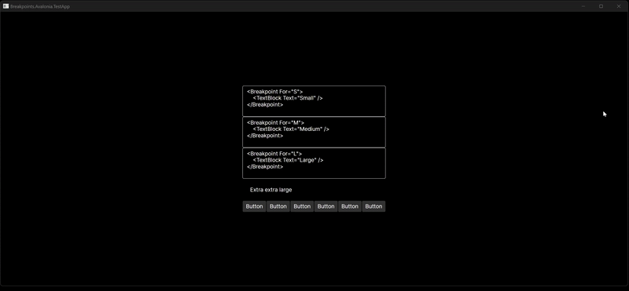

# Breakpoints.Avalonia

[](https://www.nuget.org/packages/Breakpoints.Avalonia) [](https://raw.githubusercontent.com/AVVI94/Breakpoints.Avalonia/master/LICENSE)

`Breakpoints.Avalonia` is a library for [Avalonia UI](https://avaloniaui.net/) that provides responsive design capabilities using breakpoints. It allows you to define different UI layouts and behaviors based on the size of the application window (or any other element!).



## Table of Contents

- [Features](#features)
- [Installation](#installation)
- [Setup](#setup)
- [Defining Breakpoints and Breakpoint Providers](#defining-breakpoints-and-breakpoint-providers)
- [Using Breakpoints](#using-breakpoints)
  - [Using the Breakpoint Control](#using-the-breakpoint-control)
  - [Using the Breakpoint Markup Extension](#using-the-breakpoint-markup-extension)
- [License](#license)

## Features

- User-defined breakpoints for different screen sizes.
- Use markup extensions to apply different values based on the current breakpoint - predefined breakpoint names only.
- Support for exclusive breakpoints and upper bounds.

## Installation

NuGet package:

```
dotnet add package Breakpoints.Avalonia
```

[Link](https://www.nuget.org/packages/Breakpoints.Avalonia)

## Setup

I tried to make using this library as simple as possible, including merging my namespaces with Avalonia namespaces. Thanks to this (dirty) solution, you don't have to specify a custom XML namespace (xmlns) and you can use breakpoints directly.

### App.xaml

In your `App.axaml` file, add the `ResponsivityBreakpoints` resource:


```xml
<Application.Styles>
    <FluentTheme />
    <ResponsivityBreakpoints />
</Application.Styles>	
```

### Defining breakpoints and breakpoint providers

The library searches for breakpoints in the logical tree of your view for the first element that has the attached property `Breakpoints.IsBreakpointProvider` set to `True`. This element must also have the `Breakpoints.Values` property set. The `Values` property specifies the provided breakpoints. `Breakpoints.IsBreakpointProvider` can be set in XAML directly or with binding, or you can set it from code-behind. The `Breakpoints.Values` property can only be set with binding or from code-behind because the type of the property is a custom breakpoint collection which cannot be instantiated and initialized in XAML.

The logical tree is searched upwards from the element that requested the breakpoint. The breakpoint provider can be any element that inherits from `Layoutable` (basically anything that has width and height properties and will be in the logical tree), e.g., Window, UserControl, Border, Grid, etc.

#### Set up breakpoints

To set up the breakpoint values, create a new instance of `Breakpoints.Avalonia.Collections.BreakpointList` and add your desired breakpoint values:

```cs
BreakpointList bp = [
    ("XS", 600),
    ("S", 800),
    ("M", 1000),
    ("L", 1200),
    ("XXL", 1600)
];
```

Then get the element you want to provide the breakpoints and set `Breakpoints.Values` to the collection instance:

```cs
var provider = (MainWindow)this;
Breakpoints.Avalonia.Controls.Breakpoints.SetValues(provider, bp);
```

Full MainWindow code-behind:

```cs
using Avalonia.Controls;
using Breakpoints.Avalonia.Collections;

namespace Breakpoints.Avalonia.TestApp
{
    public partial class MainWindow : Window
    {
        public MainWindow()
        {
            InitializeComponent();
            BreakpointList bp = [
                ("XS", 600),
                ("S", 800),
                ("M", 1000),
                ("L", 1200),
                ("XXL", 1600)
            ];
            Controls.Breakpoints.SetValues(this, bp);
        }
    }
}
```

In the XAML of your desired breakpoint provider, set the `Breakpoints.IsBreakpointProvider` to `True`:

(MainWindow in this example)

```XML
Breakpoints.IsBreakpointProvider="True"
```

If you choose to use MainWindow as a provider, your XAML could look like this:

```XML
<Window x:Class="Breakpoints.Avalonia.TestApp.MainWindow"
        xmlns="https://github.com/avaloniaui"
        xmlns:x="http://schemas.microsoft.com/winfx/2006/xaml"
        xmlns:d="http://schemas.microsoft.com/expression/blend/2008"
        xmlns:mc="http://schemas.openxmlformats.org/markup-compatibility/2006"
        Title="Breakpoints.Avalonia.TestApp"
        d:DesignHeight="450"
        d:DesignWidth="800"
        Breakpoints.IsBreakpointProvider="true"
        mc:Ignorable="d">
    ...
</Window>
```

## Using breakpoints

You have two options for using breakpoints.

### Using the Breakpoint control

You can use the `Breakpoint` custom control, which hides itself when the breakpoint gets hit. This control works similarly to Panel controls:

```xml
<Breakpoint For=S>
    <Grid>
        ...
    </Grid>
</Breakpoint>
```

Control parameters:

* `For`: string specifying the breakpoint name. If the specified name is not found in the provided breakpoints, it will always be visible.
* `UpperBound`: string specifying the breakpoint name that is used as the upper bound. When the upper bound breakpoint is hit, the Breakpoint control gets hidden.
* `IsExclusive`: bool flag indicating whether the `For` breakpoint is exclusive. This means the control is only visible in the range for the specified breakpoint. For example, if you set `For="S"` and the breakpoint provider's width gets bigger than breakpoint `S + 1` (so breakpoint `M`), this control will be hidden.
* `Enabled`: bool flag indicating whether this control's visibility can be altered by breakpoints. This flag has the highest priority. The default value is `True`. If you set this to `False`, this control will **always** be hidden.

### Using the Breakpoint markup extension

You can also use the markup extension with predefined breakpoint names (not values, just names). This extension usage is similar to the official OnPlatform extension. Names of the breakpoints in the BreakpointList must match properties of the Breakpoint markup extension class (Default property is excluded).

```XML
 <StackPanel Orientation="{Breakpoint Vertical, M=Horizontal}">
     <Button Content="Button" />
     <Button Content="Button" />
     <Button Content="Button" />
     <Button Content="Button" />
     <Button Content="Button" />
     <Button Content="Button" />
 </StackPanel>
```

You can specify a default value that will be used when no other smaller breakpoint has a specified value. In the example above, the stack panel will have vertical orientation for anything smaller than the breakpoint value specified for `M`.

This markup extension also supports Converters (IValueConverter). It may also support bindings for values, although this has not been tested.

The markup extension implementation does not support upper bounds or exclusive breakpoints.
